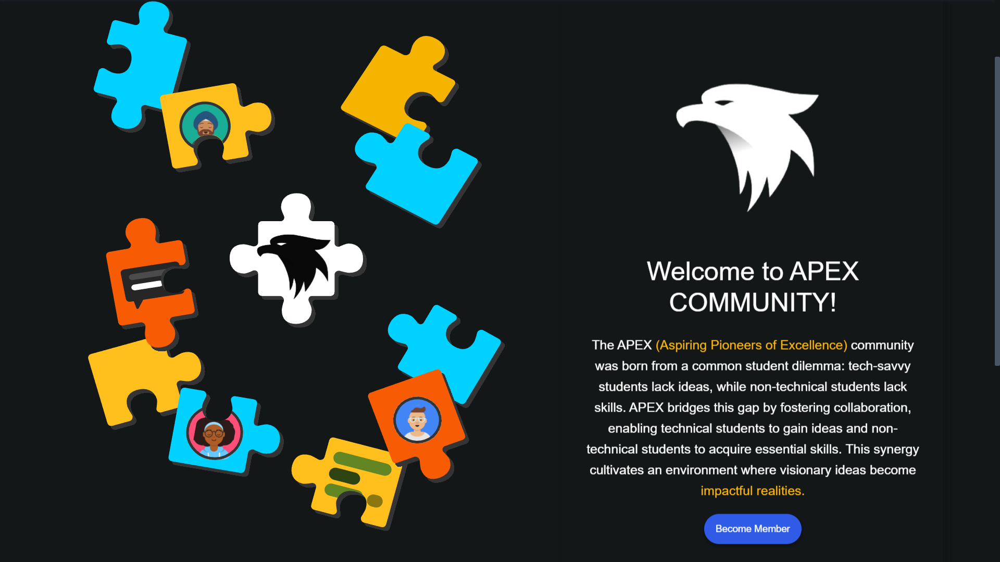
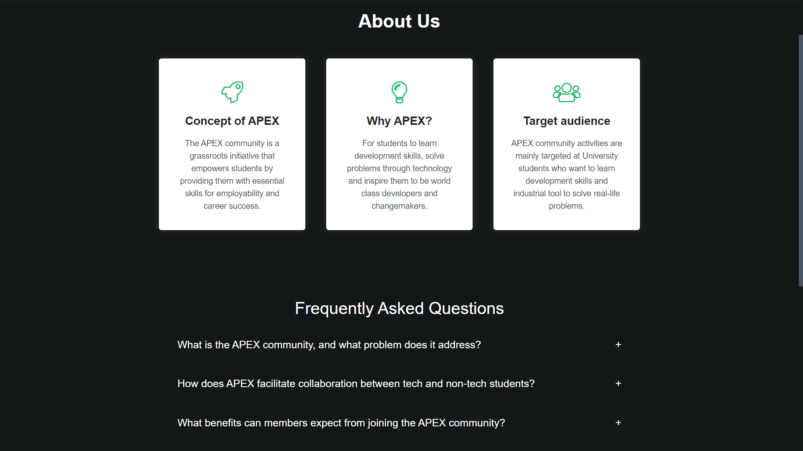

<!-- PROJECT LOGO -->
<br />
<p align="center">
  <a href="">
    
  </a>
  <h1 align="center">APEX COMMUNITY Website</h1>
</p>

## APEX Community Website 🔗
[**Visit Now**](https://apex-website-glues.vercel.app/)

## 🛠️ Tech Stack
[](https://github.com/arnabjena007/Portfolio-Website/search?l=html)&nbsp;
[](https://github.com/arnabjena007/Portfolio-Website/search?l=css)&nbsp;
[](https://github.com/arnabjena007/Portfolio-Website/search?l=javascript)&nbsp;
[](https://github.com/arnabjena007/Portfolio-Website/search?l=javascript)&nbsp;
[](https://github.com/arnabjena007/Portfolio-Website/search?l=css)
[](https://firebase.google.com/docs/firestore)
[](https://vercel.com/)

## 🖼️ Sneak Peek of Pages



## 📬 Contact Me
- [LinkedIn](https://www.linkedin.com/in/arnabjena/)

## Features
- Clean and minimal design
- Responsive layout
- Easy to customize
- Lightweight and fast

## Table of Contents
<details open="open">
  <summary>Table of Contents</summary>
  <ol>
    <li>
      <a href="#about-the-project">About The Project</a>
      <ul>
        <li><a href="#built-with">Built With</a></li>
        <li><a href="#file-structure">File Structure</a></li>
        <li><a href="#before-you-start"> Before You Start</a></li>
      </ul>
    </li>
    <li><a href="#getting-started">Getting Started</a></li>
    <li><a href="#roadmap">Roadmap</a></li>
    <li><a href="#license">License</a></li>
    <li><a href="#contact">Contact</a></li>
  </ol>
</details>

<!-- ABOUT THE PROJECT -->

## About The Project

Introducing APEX's inaugural community website, designed for engagement and showcasing initiatives. Tailored to serve community members, collaborators, the platform will highlight projects, events, and key information. With a user-centric design adhering to APEX's brand identity, the website will employ a streamlined tech stack, leveraging Firebase for backend functionality. Collaboration opportunities will be extended to the community for content creation and development. The project will adhere to a clear timeline, ensuring timely delivery and continuous improvement through feedback loops. 

## Built With

The tech stack we will be using:

- HTML
- CSS
- JavaScript
- Bootstrap

<!-- USAGE EXAMPLES -->

## File Structure

```
  ├── assets/
        ├──img/               contains all images (don't use caps or space in file name).
        ├──font/              contains .ttf folder
        ├──logo(png,svg)      contains the logo in (png,svg).
  ├── css/
        ├──settings.css       all the default styling settings.
        ├──(all css files)    all other css files for pages.
  ├── js/
        ├──index.js           all the scripts/functions for main page.
        ├──script.js          all the scripts/functions for website.
        ├──register.js        all the scripts/functions for registation page.
        ├──project.data.js
        ├──team2024.js        all the scripts/functions for project page.
        ├──team2023.js        all the scripts/functions for team page.
        ├──testimonial-slider.js        all the scripts/functions for testimonial section.
  ├── pages/
        ├──(all pages)        all pages of website.
  ├── index.html              main page of the website.
```

<!-- NOTE -->

## Before You Start

- Always maintain the **file format & folder structure.**
- Maintain proper file names (i.e, for images).

---

<!-- GETTING STARTED -->

```
<!-- GETTING STARTED -->

## Getting Started

Below are the steps to follow to contribute to this project:

1. **Fork [this repository](https://github.com/arnabjena007/Apex_Website)** 🍴.

2. **Clone your forked copy of the project**.
   ```shell
   git clone https://github.com/<your_user_name>/APEX.github.io.git
   ```
   Replace `<your_user_name>` with your GitHub username.

3. **Navigate to the project directory** 📁.
   ```shell
   cd APEX_Website.github.io
   ```

4. **Add a reference(remote) to the original repository**.
   ```shell
   git remote add upstream https://github.com/APEX_Website/APEX_Website.github.io.git
   ```

5. **Check the remotes for this repository**.
   ```shell
   git remote -v
   ```

6. **Always fetch changes from the upstream repository to keep your local copy updated**.
   ```shell
   git fetch upstream
   ```

7. **Merge the changes from the upstream repository to your main branch**.
   ```shell
   git merge upstream/main
   ```

8. **Create a new branch for your work** 🌿.
   ```shell
   git checkout -b <your_branch_name>
   ```

9. **Make necessary changes and commit those changes** 🛠️.
   ```shell
   git add .
   git commit -m "Your commit message"
   ```

10. **Push the committed changes to your feature branch on your remote repository**.
    ```shell
    git push -u origin <your_branch_name>
    ```

11. **Create a pull request**.
    - Go to the GitHub page of your forked repository.
    - Click on the "New pull request" button.
    - Select the base branch and your feature branch for the pull request.

12. **Add appropriate title and description to your pull request explaining your changes and efforts**.

13. **Click on `Create Pull Request`**.

14. **Congratulations! You've created a pull request** 🎉. Be patient while we review your code and merge the changes.

<!-- ROADMAP -->

## Roadmap

See the [open issues](https://github.com/APEX_Website) for a list of proposed features and known issues.

<!-- LICENSE -->

## License

This project is licensed under the [MIT License](LICENSE).

<!-- CONTACT -->

## Contact

If you have any questions or concerns, feel free to email us at apexcommunity.mitblr@gmail.com 📧.

<p align="center">Made with ❤️ | Hosted on <a href="https://apex-website-gules.vercel.app/">Vercel</a></p>
